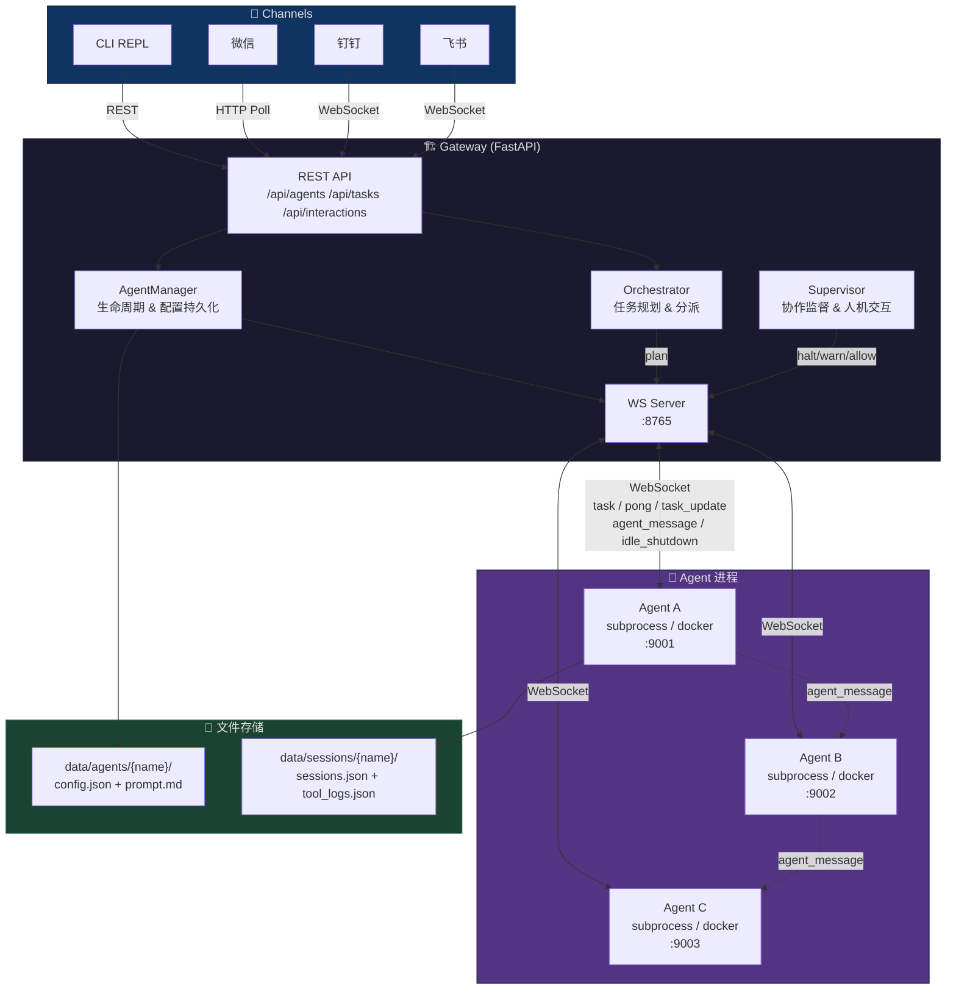

# CrewCraft

多 Agent 协作平台。Gateway 常驻服务管理 Agent 生命周期，通过 CLI / 钉钉 / 飞书 / 微信等 Channel 下发任务，内置 Orchestrator 自动编排 + Supervisor 协作监督。

## 架构



**流程**：Channel → MsgManager 消息总线 → Orchestrator 规划 → WS 分派给 Agent → Agent 间协作受 Supervisor 监督 → 结果返回 Channel

## 快速开始

### 本地开发

```bash
# 安装
uv sync

# 启动 Gateway（终端 1）
uv run crewcraft gateway start

# 交互式 REPL（终端 2）
uv run crewcraft
> /agent create researcher --desc "擅长搜索和整理技术资料"
> 帮我研究 Python 3.13 新特性    # 自动编排，无需指定 agent
```

### Docker 部署

```bash
docker build -f Dockerfile.agent -t crewcraft-agent .
docker compose up -d
uv run crewcraft  # 交互
```

## CLI

```
crewcraft                  # 进入交互 REPL（默认）
crewcraft gateway start    # 启动 Gateway
crewcraft -V               # 版本
```

### REPL 斜杠命令

| 命令 | 说明 |
|------|------|
| `/agent create <name> --model <m> --desc <...>` | 创建 Agent（自动生成 prompt） |
| `/agent list` | 列出所有 Agent |
| `/agent inspect <name>` | 查看 Agent 详情 |
| `/agent delete <name>` | 删除 Agent |
| `/task run <content>` | 创建任务（自动编排） |
| `/task run <content> --agent <a>` | 指定 Agent 执行 |
| `/task status <id>` | 任务状态 |
| `/task list` | 任务列表 |
| `/session list --agent <a>` | 会话列表 |
| `/session show <id> --agent <a>` | 对话历史 |
| `/tool list` | 可用工具 |
| `/help` | 帮助 |
| `/exit` | 退出（Ctrl+D） |

直接输入文字自动作为任务发给 Orchestrator 编排。

## API

Gateway 监听 `http://127.0.0.1:8000`

### Agents

| 方法 | 路径 | 说明 |
|------|------|------|
| `POST` | `/api/agents` | 创建 Agent（自动生成 prompt） |
| `GET` | `/api/agents` | Agent 列表 |
| `GET` | `/api/agents/{name}` | Agent 详情 |
| `DELETE` | `/api/agents/{name}` | 软删除 Agent |

### Tasks

| 方法 | 路径 | 说明 |
|------|------|------|
| `POST` | `/api/tasks` | 创建任务（`agent_name` 可选） |
| `GET` | `/api/tasks/{task_id}` | 任务状态 |
| `GET` | `/api/tasks` | 任务列表 |

### Sessions & Tools

| 方法 | 路径 | 说明 |
|------|------|------|
| `GET` | `/api/agents/{name}/sessions` | 会话列表 |
| `GET` | `/api/agents/{name}/sessions/{id}` | 对话历史 |
| `GET` | `/api/agents/{name}/sessions/{id}/tools` | Tool 日志 |
| `GET` | `/api/tools` | 可用工具列表 |

### 人机交互

| 方法 | 路径 | 说明 |
|------|------|------|
| `POST` | `/api/interactions/submit` | Agent 提交交互请求 |
| `GET` | `/api/interactions/pending` | 待处理列表 |
| `POST` | `/api/interactions/{id}/resolve` | 用户响应 |

交互类型：`confirm`（确认）、`select`（选择）、`input`（输入）

## 数据存储

纯文件系统，目录 `data/`（可配置，gitignore）：

```
data/
├── agents/
│   ├── {name}/
│   │   ├── config.json      # Agent 配置
│   │   └── prompt.md         # 生成的 system prompt（可手动修改）
│   └── deleted/              # 软删除备份
│       └── {name}_{ts}_{uid}/
└── sessions/
    └── {name}/
        ├── sessions.json      # 完整对话历史
        └── tool_logs.json     # Tool 调用详情
```

## 配置

复制 `.env.example` 为 `.env` 自定义：

| 环境变量 | 默认值 | 说明 |
|----------|--------|------|
| `CREWCRAFT_DATA_DIR` | `data` | 数据目录 |
| `CREWCRAFT_GATEWAY_HOST` | `127.0.0.1` | REST 地址 |
| `CREWCRAFT_GATEWAY_PORT` | `8000` | REST 端口 |
| `CREWCRAFT_WS_HOST` | `127.0.0.1` | WS 地址 |
| `CREWCRAFT_WS_PORT` | `8765` | WS 端口 |
| `CREWCRAFT_AGENT_DEPLOY_MODE` | `subprocess` | subprocess / docker |
| `CREWCRAFT_AGENT_PORT_START` | `9001` | Agent 起始端口 |
| `CREWCRAFT_AGENT_IDLE_TIMEOUT` | `300` | 空闲超时(s) |
| `CREWCRAFT_AGENT_HEARTBEAT_INTERVAL` | `15` | 心跳间隔(s) |
| `CREWCRAFT_MAX_MISSED_PINGS` | `3` | 心跳丢失上限 |
| `CREWCRAFT_TASK_TIMEOUT` | `300` | 任务超时(s) |
| `CREWCRAFT_COLLAB_MAX_ROUNDS` | `10` | 协作最大轮次 |
| `CREWCRAFT_COLLAB_MAX_DEPTH` | `3` | 协作链最大深度 |
| `CREWCRAFT_COLLAB_TIMEOUT` | `60` | 协作超时(s) |
| `CREWCRAFT_COLLAB_SUPERVISOR_MODE` | `hybrid` | llm / hybrid / sampling |
| `CREWCRAFT_DEFAULT_MODEL` | `deepseek:deepseek-chat` | 默认 LLM |
| `CREWCRAFT_TIMESTAMP_FORMAT` | `%Y%m%dT%H%M%S` | 时间格式 |
| `CREWCRAFT_LOG_LEVEL` | `INFO` | 日志级别 |

## 内置工具

Agent 默认可用工具：`web_search` `web_fetch` `shell_exec` `file_ops` `time_now` `calculator` `random_number` `text_stats` `json_tool` `base64` `hash` `uuid_gen` `send_to_agent` `broadcast_to_agents`

查看：`uv run crewcraft tool list`

## 项目结构

```
CrewCraft/
├── app/
│   ├── gateway/          # Gateway 服务（FastAPI + WS + 生命周期管理）
│   │   ├── api/          # REST 路由（agents, tasks, tools, interactions）
│   │   └── manager/      # AgentManager, WSManager, Supervisor
│   ├── agent/            # Agent 进程（deepagents + tools + prompt 生成）
│   │   ├── tools/        # 内置工具注册表
│   │   └── providers/    # Provider 插件（subprocess/docker/claude/codex）
│   ├── channels/         # IM Channel（CLI, 微信, 钉钉, 飞书）
│   ├── cli/              # CLI 子命令 + REPL
│   └── config.py         # 集中配置
├── Dockerfile            # Gateway 镜像
├── Dockerfile.agent      # Agent 运行时镜像
├── docker-compose.yml    # 一键部署
├── docs/                 # 设计文档
└── pyproject.toml
```

## 开发

```bash
uv sync --dev
uv run pytest  # 284 tests（含 lint）
```
