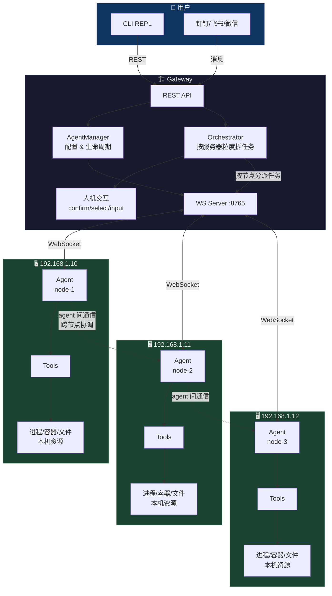
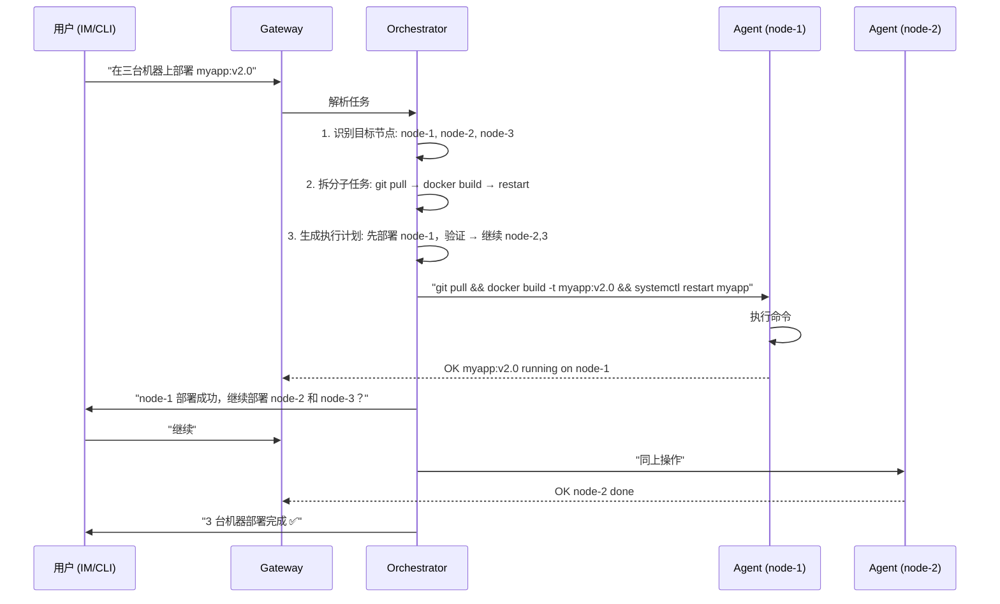
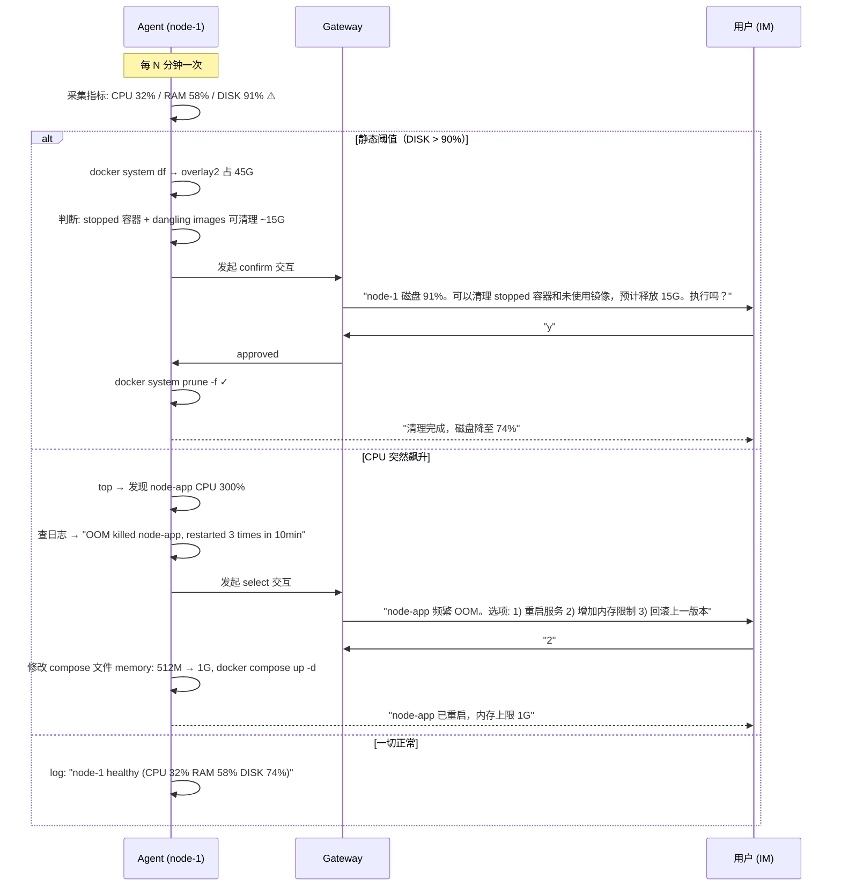
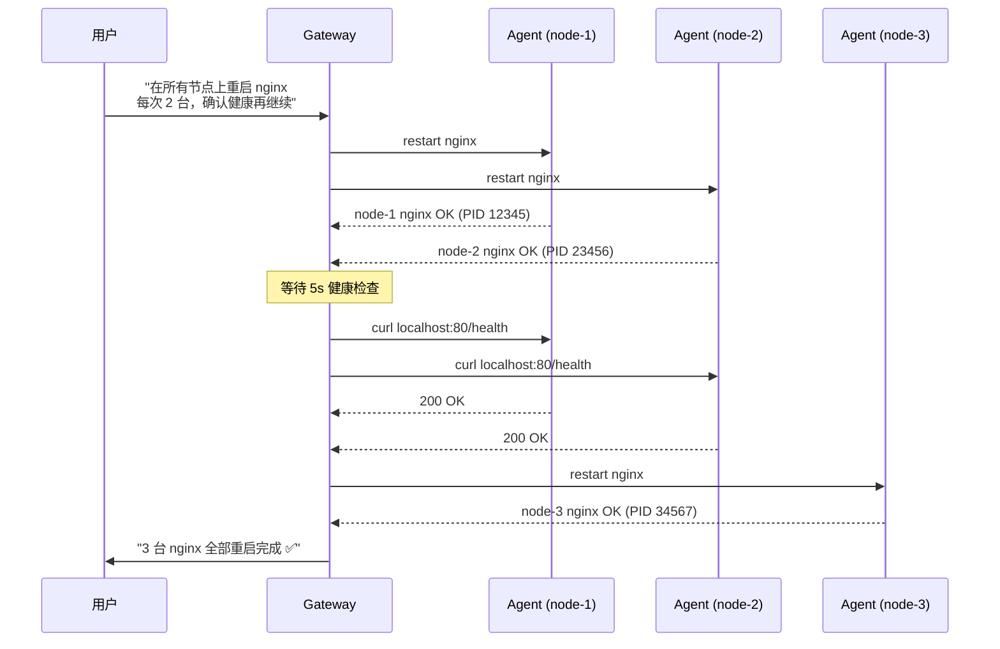

# 015: 服务器 Agent 集群设计方案

## 核心思路

每个 Agent 绑定一台物理服务器，负责这台机器上的一切。不再把 Agent 当作"专家角色"（Python 专家、QA 专家），而是当作**服务器的 AI 管理员**。

```
"部署服务到 3 台机器" → Gateway → node-1 agent 执行 + node-2 agent 执行 + node-3 agent 执行 → 汇总结果
```

## 架构图



## 完整流转逻辑

### 场景 A：用户下达任务（主动执行）



### 场景 B：Agent 自主监测 + 处理



### 场景 C：跨节点协调操作



## Agent 系统提示词设计

```markdown
You are the AI administrator of server {hostname} ({ip}).

## Your responsibilities
- Monitor system health (CPU, memory, disk, processes, containers)
- Execute user tasks on this server
- Diagnose and fix issues autonomously when safe
- Escalate to human when operation is dangerous or ambiguous

## Server context
- Hostname: {hostname}
- IP: {ip}
- OS: {os}
- Containers: {containers}
- Services: {services}
- Important paths: {paths}

## Rules
1. read operations (df, ps, top, docker ps, cat configs) → auto-approve
2. safe operations (restart service, clean temp files) → execute, log, notify
3. dangerous operations (rm, docker prune, modify system config) → confirm with human
4. NEVER modify /etc/passwd, /etc/shadow, /etc/ssh/sshd_config
5. ALWAYS log your actions to data/sessions/{agent_name}/actions.log
6. If unsure, escalate rather than guess
```

## 新增工具

| 工具 | 权限 | 说明 |
|------|------|------|
| `system_info` | read | 采集 CPU/内存/磁盘/负载 |
| `process_list` | read | 列出进程（top/ps） |
| `process_kill` | dangerous | 终止进程 |
| `service_ctl` | write | 启动/停止/重启 systemd 服务 |
| `container_ctl` | write | 管理 Docker 容器 |
| `container_clean` | dangerous | 清理 stopped 容器/未用镜像 |
| `log_read` | read | 读取系统日志/服务日志 |
| `deploy_app` | write | git pull + docker build + restart |
| `file_edit` | write | 编辑配置文件 |
| `health_check` | read | 检查服务健康状态 |

## 监控循环

```python
# 每个 Agent 独立运行的监控循环
async def monitor_loop(agent_name: str, interval: int = 300):
    while True:
        try:
            metrics = collect_system_metrics()
            if is_critical(metrics):
                # 磁盘 > 95% / 内存 > 98% → 立即告警
                await escalate_to_human(metrics)
            elif needs_attention(metrics):
                # 磁盘 80-95% / 异常进程 → LLM 判断
                action = await llm_check(metrics)
                if action.risk == "safe":
                    await execute(action)
                    await log_and_notify(f"自动处理: {action}")
                else:
                    await request_confirmation(action)
            else:
                logger.info(f"{agent_name}: all good")
        except Exception:
            logger.exception("monitor loop error")

        await asyncio.sleep(interval)
```

## 跟现有架构的改动点

| 模块 | 现状 | 需要改 |
|------|------|--------|
| Agent system prompt | "你是 XX 专家" | "你是 XX 服务器的管理员" |
| Orchestrator | 按专家角色拆任务 | 按服务器粒度拆任务 |
| 工具注册表 | 14 个通用工具 | + 6 个服务器管理工具 |
| 人机交互 | confirm/select/input | 不用改 |
| Agent 间通信 | agent_message | 保留，用于跨节点协调 |
| 心跳/生命周期 | 正常 | 不用改 |
| IM Channel | 正常 | 不用改 |

## 从单台到集群的渐进路径

```
Phase 1: 单机 agent（本机或 Docker）
  └── 在一台机器上跑通: 采集 → 判断 → 执行 → 通知

Phase 2: 单机 agent + 真实任务
  └── 部署服务、查日志、改配置、重启

Phase 3: 双机 agent
  └── "在两台机器上部署" → 验证跨节点编排

Phase 4: N 机集群
  └── 批量操作、健康汇总、统一告警
```
